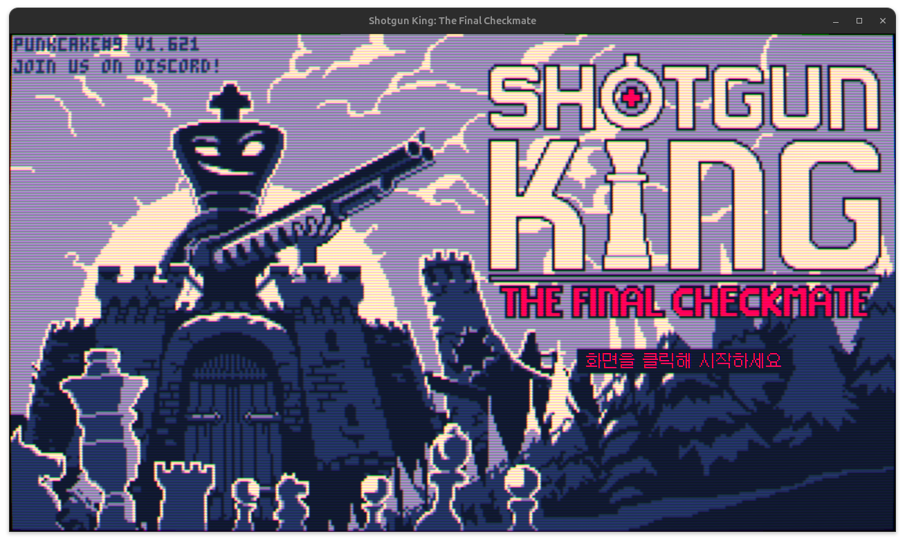

# Shotgun King Reinforcement Learning Project

Piece templates, training screenshots, annotations, datasets, and model checkpoints are kept locally and excluded from Git. Offline image checks require the private assets and fixtures to be present. Documentation images in `docs/assets/` are included in Git.

This project is rebuilding a screen-based Shotgun King agent around reviewed visual data. The current maintained workflow collects private screenshots, reviews board and page-state annotations locally, and builds datasets without publishing game assets. The older live-control and DQN runtime remains experimental while its observation and transition logic is audited.

## Maintained Data Workflow

1. Put private screenshots in `data/collection/inbox/`.
2. Import and prepare one play session with `.venv/bin/python tools/preprocess/prepare_collection.py --session SESSION_ID`.
3. Review board labels and page state with `.venv/bin/python tools/review/review_collection.py --open`.
4. Build a new immutable dataset directory with `.venv/bin/python tools/preprocess/build_piece_dataset.py --output data/collection/datasets/NAME`.

The implementation lives in the `shotgun_king_rl.collection` and `shotgun_king_rl.review` packages. Files under `tools/` preserve the existing command-line interface.

## Legacy Runtime Architecture

The system operates in a closed loop across four main phases:

1. Capture: Active screen capture of the window using mss.
2. Analyze: Slicing the chessboard area, detecting pieces, and reading UI status.
3. Decide: DQN agent inputs the processed state vector and outputs an action.
4. Control: Simulating inputs through PyAutoGUI mouse clicks or key presses.

## Legacy Gymnasium Environment Specification

The custom environment ShotgunKingEnv maps game frames to the OpenAI Gymnasium standard.

- Observation Space: 281-dimensional float vector
  - Board Matrix (dimensions 0-63): 8x8 flattened grid representing piece coordinates (0: Empty, 1: Player King, 2: Pawn, 3: Knight, 4: Bishop, 5: Rook, 6: Queen/King).
  - Threat Matrix (dimensions 64-127): 8x8 flattened grid projecting active enemy attack lines.
  - Ammo Status (dimensions 128-129): Real-time sync of loaded and reserve ammo counts.
  - Weapon Specifications (dimensions 130-132): Flat values representing weapon damage, range limit, and spread.
  - Buff/Debuff Status (dimensions 133-152): Status encoding for active card effects (e.g. move range bonus).
  - Enemy HP Matrix (dimensions 153-216): Flattened 8x8 grid representing hit points of enemies.
  - Enemy Turn Speed Matrix (dimensions 217-280): Flattened 8x8 grid representing movement speed points of enemies.
- Action Space: Dynamic discrete actions depending on active buffs
  - Default (move_range_bonus = 0): 10 discrete actions
    - Actions 0-7: 8-directional 1-tile movement clicks relative to the Player King.
    - Action 8: Manual reload keypress.
    - Action 9: Directed shoot click targetting the closest eligible enemy.
  - Enhanced (move_range_bonus = 1): 18 discrete actions
    - Actions 0-9: Identical to default actions.
    - Actions 10-17: 8-directional 2-tile jump movement clicks. Eligible only when both the intermediate tile and the destination tile are empty.

## Image Processing Pipeline

The analyzer module extracts state vectors from raw BGR screenshots.

- Board Localization: Crops the chessboard area using fixed screen coordinates and resizes the region to 520x520 pixels.
- Cell Slicing: Divides the board into 64 unique 65x65 pixel cell patches.
- Feature Classification: Employs template matching (resized to 45x45 grayscale signals) for high-accuracy piece identification. Falls back to contour-based geometry analysis when templates are missing.
- Ammo OCR: Counts the number of active red pixels at predefined UI locations to determine ammunition counts.

## Legacy Model Details

- Policy Network: Multi-input neural network fusing spatial chess board configurations and non-spatial attributes. The spatial grid data (state, threat, hp, turn speed) is processed via 2-layer Conv2d layers and flat-projected to a 64-unit vector. The meta attributes (ammo, weapon, status) are processed via a 16-unit linear projection. These representations are concatenated and passed through joint decision layers to estimate Q-values.
- Optimization: Backpropagation via MSE loss and Adam optimizer. Trains on experience tuples sampled from a ReplayBuffer.

## Installation and Execution

### Prerequisites

- Display Configuration: The game must be run in windowed mode at 1280x720 resolution. Do not minimize, cover, or obstruct the game window during execution.
- Emergency Stop: Sweep the mouse pointer to the top-left corner of the screen (coordinates 0,0) to instantly interrupt training.

### Setup and Running

1. Installation: Install the required packages listed in pyproject.toml.
2. Review collected screenshots: Run `.venv/bin/python tools/review/review_collection.py --open`.
3. Legacy runtime: Run `.venv/bin/python train.py` only when the game is visible and after reviewing the current limitations. Training is never started by the data tools.
